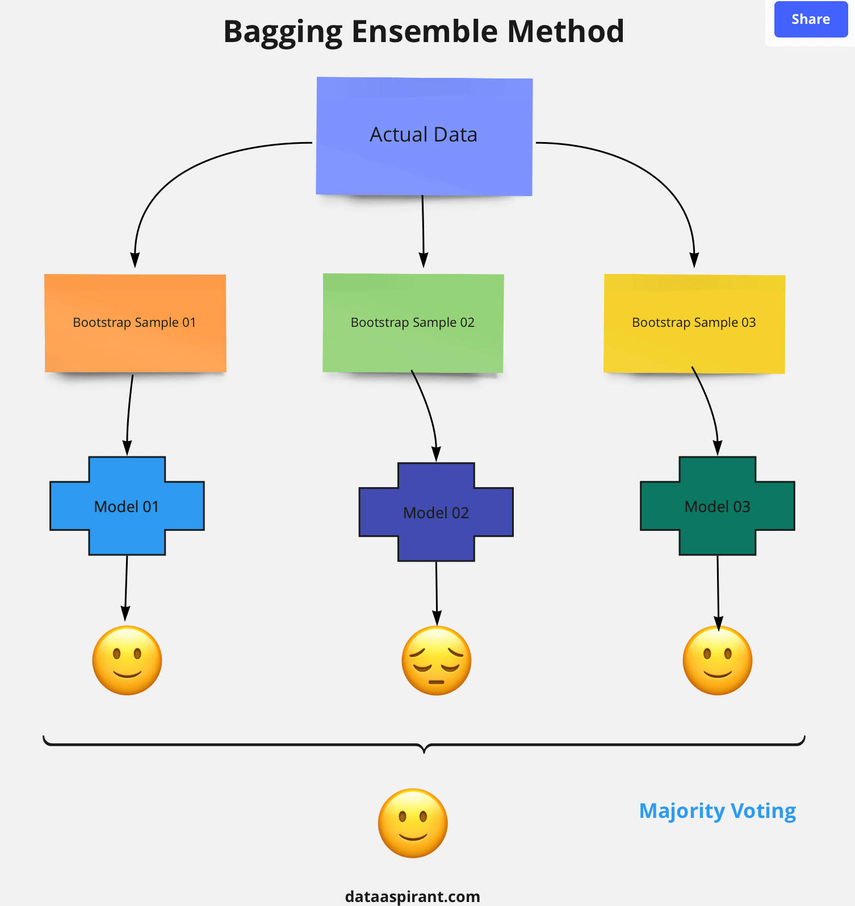

# RandomForest & 'criterion' 옵션

```python
from sklearn.ensemble import RandomForestRegressor
model = RandomForestRegressor()
```


#### RandomForest란?

https://www.analyticsvidhya.com/blog/2021/06/understanding-random-forest/

여러 개의 의사결정나무를 만들어서 이들의 평균으로 예측의 성능을 높이는 방법이며, 이러한 기법을 앙상블(Ensemble) 기법이라고 한다. 

주어진 하나의 데이터로부터 여러 개의 랜덤 데이터셋을 추출해, 각 데이터셋을 통해 모델을 여러 개 만들 수 있다.

의사 결정 나무는 가지치기(오차를 크게 할 위험이 높거나 부적절한 추론규칙을 가지고 있는 가지 또는 불필요한 가지를 제거하는 단계)를 함에도 불구하고 overfitting(학습 데이터를 과하게 학습해 실제 데이터에서는 정확도가 떨어지는 현상)되는 경향이 있어 일반화 성능이 좋지 않다.

이를 보완하기 위해 앙상블 기법을 사용하는 것이다.




*bootstrap: 표본에서 재표본을 여러번 추출하여 표본에 대해 더 자세히 알고자 하는 데 사용됨


## RandomForestRegressor()의 criterion 옵션

"랜덤포레스트 모듈의 옵션 중 criterion 옵션을 통해 어떤 평가척도를 기준으로 훈련할 것인지 정할 수 있습니다. 

따릉이 대회의 평가지표는 RMSE 입니다. RMSE 는 MSE 평가지표에 루트를 씌운 것으로서, 모델을 선언할 때 criterion = ‘mse’ 옵션으로 구현할 수 있습니다."


### RandomForestRegressor()

랜덤포레스트 회귀 분석


### model = RandomForestRegressor(criterion = 'mse')

- RMSE(Root Mean Squared Error): 예측값과 실제값을 뺀 후 제곱시킨 값들을 모두 더하고 n으로 나눈 후 루트를 씌운다. 쉽게 말해 오차의 제곱에 대한 평균으로, 이 값이 작을 수록 원본과의 오차가 적은 것이므로 추측한 값의 정확성이 높은 것이다. (criterion의 디폴트 값으로, "squared_error"로 용어 변경됨.)