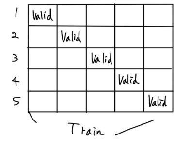
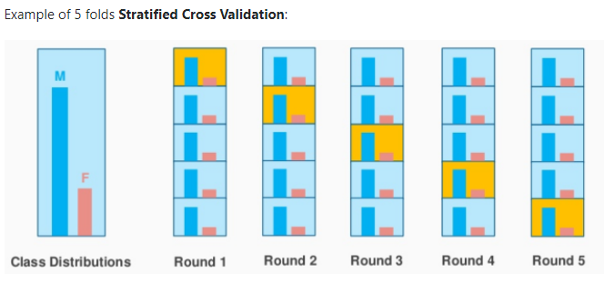

# RandomForestClassfier, Kfold

## RandomForestClassfier

### 사이킷런 모델

https://scikit-learn.org/stable/modules/generated/sklearn.ensemble.RandomForestClassifier.html

- **n_estimators** : 모델에서 사용할 트리 갯수(학습시 생성할 트리 갯수)
- **criterion** : 분할 품질을 측정하는 기능 (default : gini)
  - [지니와 엔트로피](https://wyatt37.tistory.com/9) 
  - 결론 
    - 시간을 투자해서 더 나은 성능을 원하면 엔트로피
    - 준수한 성능과 빠른 계산을 원하면 지니
    - 그떄마다 좋은 성능을 나타내는 것이 다름
- **max_depth** : 트리의 최대 깊이
- min_samples_split : 내부 노드를 분할하는데 필요한 최소 샘플 수 (default : 2)
- min_samples_leaf : 리프 노드에 있어야 할 최소 샘플 수 (default : 1)
- min_weight_fraction_leaf : min_sample_leaf와 같지만 가중치가 부여된 샘플 수에서의 비율
- **max_features** : 각 노드에서 분할에 사용할 특징의 최대 수
- max_leaf_nodes : 리프 노드의 최대수
- min_impurity_decrease : 최소 불순도
- min_impurity_split : 나무 성장을 멈추기 위한 임계치
- **bootstrap** : 부트스트랩(중복허용 샘플링) 사용 여부
- oob_score : 일반화 정확도를 줄이기 위해 밖의 샘플 사용 여부
  - Out-Of-Bag (OOB)
  - 일반적으로 훈련 샘플의 63%만 샘플링 되고 나머지 37%의 데이터는 훈련에 쓰이지 않는다.
- **n_jobs** :적합성과 예측성을 위해 병렬로 실행할 작업 수
- **random_state** : 난수 seed 설정
  - [random_state](https://miinkang.tistory.com/19)
  - **데이터를 섞을때 일관적이게 섞고 싶을 때 사용하는 것**이 seed
- verbose : 실행 과정 출력 여부
- warm_start : 이전 호출의 솔루션을 재사용하여 합계에 더 많은 견적가를 추가
- class_weight : 클래스 가중치

## K-fold

**Hold-out**

- Hold-out은 단순하게 Train 데이터를 (train, valid)라는 이름의 2개의 데이터로 나누는 작업

- 보통 train : valid = 8:2 혹은 7:3의 비율로 데이터를 나눔
- Hold-out의 문제점은 **데이터의 낭비**
- 단순하게 trian과 test로 분할하게 된다면, 20%의 데이터는 모델이 학습할 기회도 없이, 예측만하고 버려지게 된다.

**교차검증**



- "모든 데이터를 최소한 한 번씩 다 학습하게 하자!"

- 그래서 valid 데이터를 겹치지 않게 나누어 K개의 데이터셋을 만들어 낸다.
- 클래스가 편중될 가능성이 있어서 `shuffle=True`로 분할하기전에 섞기 때문에 편중될 확률이 줄어들기는 한다.

https://scikit-learn.org/stable/modules/generated/sklearn.model_selection.KFold.html?highlight=kfold#sklearn.model_selection.KFold

```python
X = train.drop(columns = ['index','quality'])
y = train['quality']

kf = KFold(n_splits = 5, shuffle = True, random_state = 0)
# shuffle=True면 random_state지정해줘야함
model = RandomForestClassifier(random_state = 0)
valid_scores = []
test_predictions = []

for train_idx, valid_idx in kf.split(X,y) : 
  X_tr = X.iloc[train_idx]
  y_tr = y.iloc[train_idx]

  X_val = X.iloc[valid_idx]
  y_val = y.iloc[valid_idx]

  model.fit(X_tr, y_tr)
  
  valid_prediction = model.predict(X_val)
  score = accuracy_score(y_val, valid_prediction)
  valid_scores.append(score)
  print(score)
print('평균 점수 : ', np.mean(valid_scores))

```

### StratifiedKFold

**불균형한 분포도를 가진 레이블 데이터를 위한 방식**

금융거래 사기 분류 모델에서 전체 데이터중 정상 거래 건수는 95% 사기인 거래건수는 5% 라면, 앞서 설명한 일반적인 교차 검증으로 데이터를 분할했을 때, 사기 거래 건수가 고루 분할 되지 못하고 한 분할에 몰릴 수 있다. 이때 데이터 클래스 별 분포를 고려해서 데이터 폴드 세트를 만드는 방법이 StratifiedKFold

https://scikit-learn.org/stable/modules/generated/sklearn.model_selection.StratifiedKFold.html

This cross-validation object is a variation of KFold that returns stratified folds. The folds are made by preserving the percentage of samples for each class.



