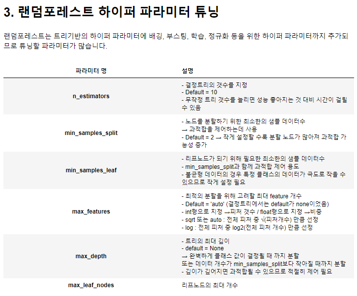

### Lv2 튜닝 1/4 python 파이썬 랜덤포레스트 변수중요도 확인

`fit()` 으로 모델이 학습되고 나면 `feature_importances_` 속성(attribute) 으로 변수의 중요도를 파악할 수 있습니다. 변수의 중요도란 예측변수를 결정할 때 각 피쳐가 얼마나 중요한 역할을 하는지에 대한 척도입니다. 변수의 중요도가 낮다면 해당 피쳐를 제거하는 것이 모델의 성능을 높일 수 있습니다.

트리 기반 모델들(randomforest, xgboost, lightgbm 등)은 기본적으로 feature importance를 모델 내장 함수로 제공합니다. 따라서 `feature_importances_` 내장 함수를 이용해서 손쉽게 구현할 수 있습니다.

```
model.feature_importances_

=>
array([0.02454563, 0.59209976, 0.18493753, 0.01852811, 0.02694173,
       0.03431467, 0.03202053, 0.03313091, 0.03266188, 0.02081925])
```

feature importance는 트리기반 모델에서 사용됩니다.즉 중요도를 구분하는데에 트리의 분할과 밀접한 관련이 있다는 말인데요, 쉽게 생각하면 **특정 feature가 트리를 분할하는데 얼마나 기여를 했는지**에 따라 중요도가 결정되는 것입니다.

예를 들어, '성별' 이라는 특성으로 분류했을때 고양이와 강아지를 잘 분류하지 못하고(순수도가 낮다), '눈동자 모양'이라는 특성으로 분류했을때 잘 분류한다면(순수도가 높다), '눈동자 모양'을 해당 트리 분할 기준으로 선택하는 것입니다.


### Lv2 튜닝 3/4 python 파이썬 하이퍼파라미터 / GridSearch 개념

Parameter : 매개변수, 모델 내부에서 결정되는 변수, 데이터로부터 학습 또는 예측되는 값 ex) 평균, 표준편차, ...

Hyper Parameter : **모델에서 우리가 직접 설정해야 하는 변수들**을 통칭해 '하이퍼파라미터'라고 한다.

하이퍼파라미터 튜닝 : 모델을 **최적화**하기 위해 하이퍼파라미터를 조정하는 과정 ‘hyperparameter **optimization**’이라고도 함

정지규칙 : 더 이상 분리가 일어나지 않고 현재의 마디가 끝마디가 되도록 하는 여러가지 규칙을 의미한다.

```
params = {'n_estimators': [200, 300, 500],
          'max_features': [5, 6, 8],
          'min_samples_leaf': [1, 3, 5]}

greedy_CV = GridSearchCV(model, param_grid=params, cv = 3, n_jobs = -1)
```

estimator : 사용할 모델, classifier, regressor, pipeline 등

param_grid : 튜닝을 위해 파라미터, 사용될 파라미터를 dictionary 형태로 만들어서 넣는다.

cv : 교차 검증에서 몇개로 분할되는지 지정한다.

n_jobs : 모델을 실행할 때 돌리는 코어의 수, -1로 할 시 컴퓨터의 모든 코어를 사용한다.


