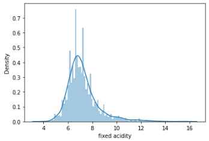
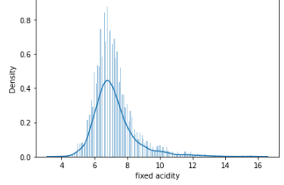
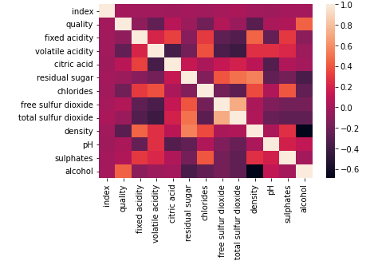
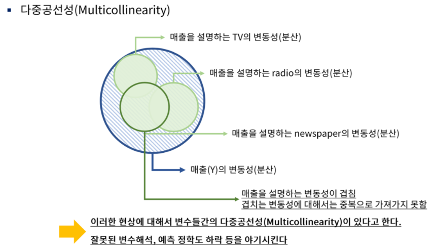
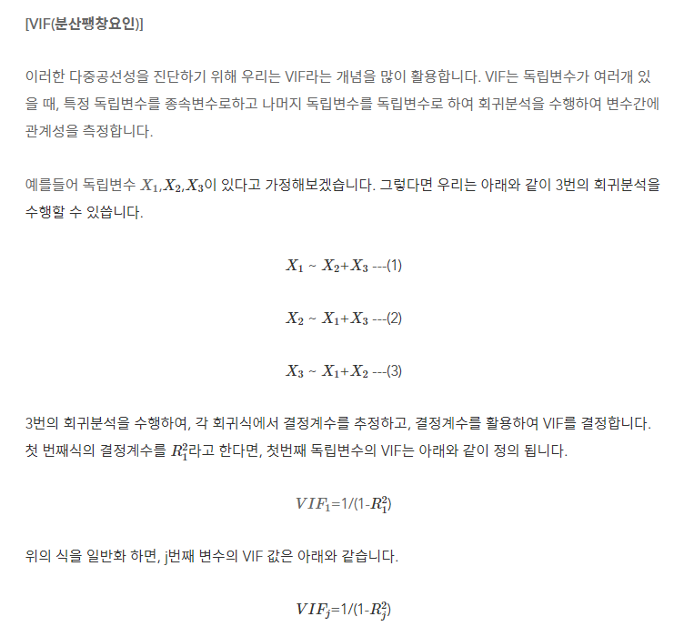
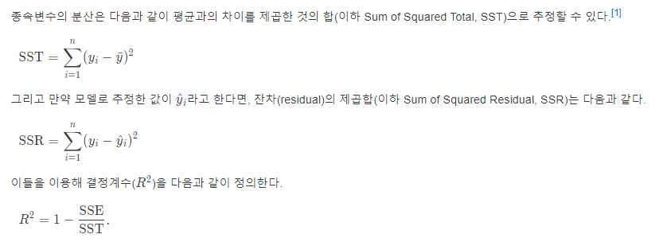

## Lv4. EDA

### seaborn pairplot

seaborn의 pairplot은 데이터에 들어 있는 각 컬럼(열)들의 모든 상관 관계를 출력합니다.

pairplot은 grid(격자) 형태로 각 집합의 조합에 대해 히스토그램과 분포도를 그립니다.


### seaborn distplot

seaborn의 distplot 함수는 데이터의 히스토그램을 그려주는 함수입니다. 

히스토그램이란 수치형 데이터 분포를 정확하게 표현해주는 시각화 방법입니다. 

변수를 여러 개의 bin으로 자르고(사용자 지정) bin당 관측수를 막대그래프로 표현합니다.

```python
sns.distplot(data,bins = 100)
```



```python
sns.distplot(data,bins = 200)
```



### seaborn heatmap

히트맵은 두개의 범주형(Categorical) 변수에 대한 반응변수의 크기를 색깔의 변화로 표현하는 것입니다.

데이터 분석 과정에서는 변수별 상관관계를 확인 할때 히트맵 그래프를 많이 사용합니다. 



- 값이 -1.0 ~ -0.7 이면, 강한 음적 상관관계
- 값이 -0.7 ~ -0.3 이면, 뚜렷한 음적 상관관계
- 값이 -0.3 ~ -0.1 이면, 약한 음적 상관관계
- 값이 -0.1 ~ +0.1 이면, 없다고 할 수 있는 상관관계
- 값이 +0.1 ~ +0.3 이면, 약한 양적 상관관계
- 값이 +0.3 ~ +0.7 이면, 뚜렷한 양적 상관관계
- 값이 +0.7 ~ +1.0 이면, 강한 양적 상관관계

### 다중 공선성

다중공선성은 상관관계가 높은 독립변수들이 동시에 모델에 포함될 때 발생합니다.

만약 두 변수가 완벽하게 다중공선성에 걸려있다면(완전공선성), 같은 변수를 두 번 넣은 것이므로 모델이 결과값을 추론하는 데 방해가 될 수 있습니다.

다중공선성은, '설명변수의 독립성' 가정을 위배할때 발생하는 문제입니다. 

참고 : 회귀분석의 기본가정들

- 선형성 : 예측하고자 하는 종속변수 y와 독립변수 x 간에 선형성을 만족하는 특성
- 독립성 : 독립변수 간에 상관관계가 없이 독립성을 만족하는 특성
- 등분산성 : 등분산성이란 분산이 같다는 것이고, 분산이 같다는 것은 특정한 패턴 없이 고르게 분포했다는 의미이다.
- 정규성 : 정규분포를 띄는지 여부를 의미한다.




### VIF(Variance Inflation Factor, 분산 팽창 요인)

VIF는 변수간의 다중공선성을 진단하는 수치이며 **범위 1부터 무한대입니다.**

통계학에서는 VIF 값이 10이상이면 해당 변수가 다중공선성이 있는 것으로 판단 합니다. 




결정계수(R^2) : 종속변수의 분산 중에서 독립변수로 설명되는 비율을 의미한다. 쉽게 말해, 이 통계 모델로 대상을 얼마나 잘 설명할 수 있는가를 숫자로 나타낸 것이 결정계수이다.


